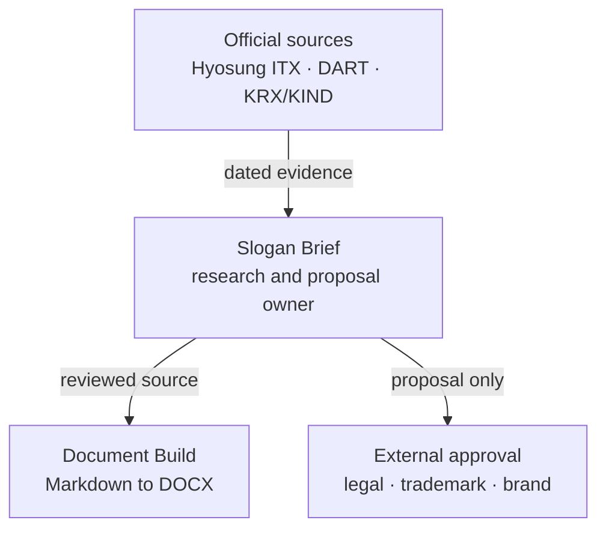
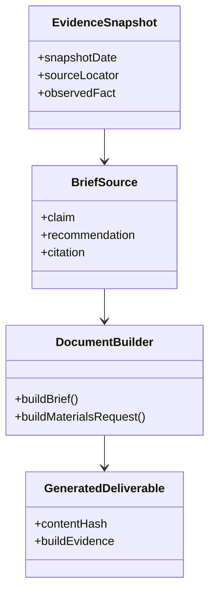

# Product and technical gap baseline

Status: Proposed  
Evidence date: 2026-10-09  
Canonical repository: `ContextualWisdomLab/hyosung-itx-slogan-brief`

## Goal and product boundary

This repository owns a finite, evidence-bound slogan research brief and its
reviewable source, generated Word deliverables, source snapshot, and document
build scripts. It does not own Hyosung ITX systems, official brand adoption,
trademark clearance, legal approval, or campaign execution.

Commercial readiness means a buyer can trace each material claim to the dated
source snapshot, reproduce the deliverables with a controlled toolchain, and
understand exactly which rights are and are not granted.

## PRD baseline

| Need | Acceptance evidence | Status |
| --- | --- | --- |
| Review the proposal without opaque binaries | Markdown sources and dated `data/source_snapshot.json` remain authoritative inputs | Implemented |
| Rebuild the Word deliverables | Build scripts regenerate both files and CI detects source/output drift | Partially implemented |
| Know whether evidence is current | README exposes the `2026-06-25` snapshot date and requires revalidation before new use | Implemented in PR #8 |
| Know whether reuse is permitted | Rights diligence records ownership, exclusions, attribution, and grant scope | Blocked by issue #9 |
| Understand product responsibility | README and this baseline distinguish research deliverables from official adoption and external authorities | Proposed in PR #8 |

## TRD baseline

The technical flow is intentionally small:

1. maintain public-source facts and locators in `data/source_snapshot.json`;
2. maintain reviewable Markdown source under `docs/`;
3. generate DOCX files through the repository-owned Node.js scripts;
4. validate the document design contract and source/output consistency in CI;
5. merge only an exact head with terminal checks and repository-governed review.

The current README rebuild commands resolve mutable npm packages without a
committed lockfile. That is usable for exploration, but it is not yet a
reproducible or supply-chain-pinned release process.

## Context Map

- **Upstream evidence:** official sites and disclosure systems remain the
  authority for company facts; the repository stores a dated snapshot and
  locators, not upstream ownership.
- **Slogan Brief bounded context:** owns the research structure, proposal
  language, provenance links, and versioned deliverables.
- **Document Build supporting context:** owns deterministic conversion and
  validation only; it cannot approve claims or rights.
- **External approval:** legal, trademark, brand, and campaign decisions stay
  outside this repository and must enter through explicit evidence.

## UML responsibility view

## ERD and persistence boundary

There is no application database or transactional aggregate in the current
product. The versioned JSON evidence snapshot and Markdown sources are
repository artifacts, not a substitute for a shared database. Introducing an
ERD, cross-repository SQL, or a new persistence service would add no present
buyer value and requires a future ADR tied to a concrete multi-user workflow.

## Gap and action register

| Gap | Evidence | Action | Status |
| --- | --- | --- | --- |
| Rights and reuse authority is incomplete | Issue #9; no root `LICENSE` | Record contract/assignment constraints, embedded assets, marks, attribution, and any separately licensable tooling before granting reuse | Blocked |
| PR #8 alignment with protected `main` | Native merge `f2bb1a3a710c30c188f9da4da607e8b139dc0835` has parents `4572161dec213310a9923b71f5e0f7740a7e12a4` and `main@c0a6c1ea2718721c74553a5be388f64af0dffada`; compare reports 4 ahead / 0 behind | Preserve the fast-forward-only history and evaluate Checks on the final exact head after this evidence repair | Implemented |
| Public policy expansion needs explicit review | PR #8 review thread and current `CHANGES_REQUESTED` review | Keep the PR Draft until scope is explicit, the thread is resolved by its reviewer/owner, and a current-head review is recorded | In progress |
| Node dependency resolution is mutable | README uses `npm install --no-save --package-lock=false docx` and unpinned `npx` | Add a minimal manifest/lock and CI rebuild contract; verify generated files from the locked toolchain | Proposed |
| Evidence can age silently | Snapshot date is `2026-06-25` | Require source revalidation and a new snapshot before a new proposal or external campaign use | Implemented in PR #8 |
| No immutable release evidence | No versioned release is asserted by current repository evidence | Publish only after rights, deterministic build, exact-head checks, and review gates are satisfied | Proposed |

## Verification authority

Historical success on a predecessor head does not prove a newer head. PR #8
must be evaluated against its current exact head after every commit. The prior PR Validation, SAST Semgrep, and Security Scan runs for
`1d5f3b9d844b7d42e3facc8aa3c936d401ccaf15` remain historical evidence only.
Native merge `f2bb1a3a710c30c188f9da4da607e8b139dc0835` proves non-force reconciliation,
but its Checks do not prove the later documentation commit that records that
fact. Only fresh terminal results attached to the final exact head are current.

## Next bounded actions

1. Obtain fresh terminal checks on the final exact head and address every
   current-head review finding.
2. Complete issue #9 rights diligence before adding any repository-wide or
   scoped reuse grant.
3. Pin the smallest viable Node.js build toolchain and prove deterministic
   regeneration of both DOCX deliverables.
4. Create an immutable release only when those gates are satisfied; do not
   claim GitHub Pages or deployment without publication evidence.
